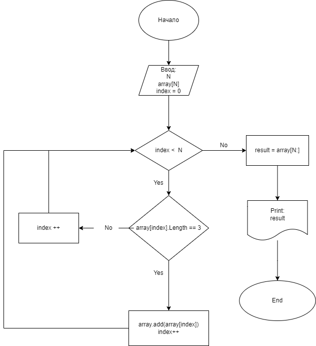

## Алгоритм решения 
1. Пишу функцию по вводу массива
2. Создаю пустой список
3. С помощью цикла прохожу по каждому элементу массива и проверяю, равняется ли его длина трем.
4. Те элементы, которые равняются трем, я сохраняю в список
5. Преобразовываю список в массив и вывожу его в консоль

## Блок-Схема

